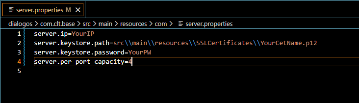
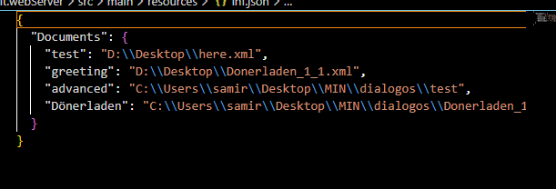
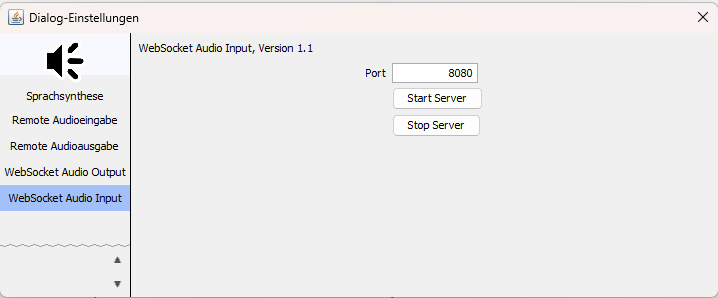
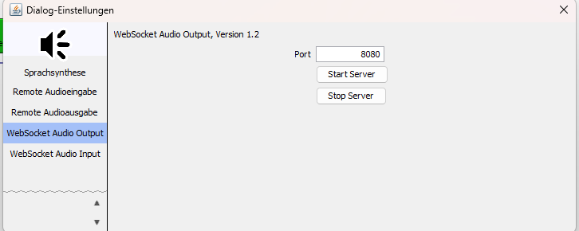

# Erklärung

## Setup
1. Erstelle einen Keystore und füge ihn ins Projekt ein, merke Passwort e.g.
    

    keytool -genkeypair -alias mycert -keyalg RSA -keysize 2048 -validity 365 -storetype PKCS12 -keystore mycert.p12
    

    Verschiebe das Certificate am besten in:
    

    
    **src\\main\\resources\\SSLCertificates\\YourCetName.p12**
    

2. Suche IP Adresse heraus auf der das Programm laufen soll:
    

    **ipconfig**
    

3. Erstelle die File:
    

    **dialogos\com.clt.base\src\main\resources\com\server.properties** 
    

    
    

    

    füge dort alles hinein. Die File ist aus Sicherheitsgründen im .gitignore, wir wollen ja nich das irgendwas ausversehen gepublisht wird.
    Dies gilt auch für den gesamten SSLCertificates Folder.
4. Füge in com.clt.webServer/src/main/resources/inf.json die Namen unter denen die Graphen zur verfügung stehen sollen und die Pfade zu den Graphen 
    Beispiel:
    

        

        
        

    

## Start
Der Command zum Starten des Server Services ist:

**./gradlew :com.clt.webServer:testAudioServer**

## Wie funktioniert's
### Server
**Website**

        Zuerst wird ein Server gestartet auf Port 8080, dieser beinhaltet die Website. 
        Nach der Auswahl des Graphen, erstellt die Website eine random ID und leitet einen Weiter. 
        Diese userID zusammen mit dem gewählten Graphen wird dann im DialogLoadServlet genutzt um eine neue Connection zu etablieren. 

 

**ConnectionManager**

    Der ConnectionManager beinhaltet die Connections, die userID und den dazu passenden GraphManager. 
    Der ConnectionManager lädt daraufhin den übergebenen Graphen mittels des GraphManager und weißt mit Hilfe des PortManager passende Port zu. 
    Der geladene Graph ist hierbei vom Typ WebDocument (Es können derzeit nur SingleDocuments geladen werden). 
    Der PortManager erlaubt bei der Portauswahl eine beliebige Anzahl X an Usern per Port (ist Hardcoded in der PortManagerklasse). Das bedeutet also, dass der PortManager über maximal Anzahl der Sessions entscheidet, nicht aber die Servlets an sich. 
    Die ausgewählten Ports (früher waren zwei unterschiedliche möglich, mittlerweile ist es der selbe Port für Input und Output) werden in den Plugins des geladenen Graphen gesetzt. 
    Die gewählten Ports und die IP-Adresse werden auch an die Website geschickt. Dadurch kann diese über Port XYZ und IP ABC mit den Endpoints connecten. 
    Der ConnectionManager setzt beim ersten Start ein GraphControlRegistry, dies gilt für die Nutzungszeit für alle Nutzer. 
    Das GraphControlRegistry erlaubt benutzung des DocumentManager und ConnectionManager innerhalb der Plugins. 
    Dadurch kann die komplette Kommunikation ausgelagert werden in das Plugin. Verbindungsabbrüche, Graphstart usw. können damit aus dem Plugin heraus über das ControlRegistry benutzt werden.

 

**Plugin**

    - HubRegistry:
    

        Das Hubregistry hält alle aktiven ports in Verbindung mit dem passenden WebSocketHub.
    

    - WebSocketHub:
    

        Ist der Server an einem Gewissen Port.  
        Er startet die Endpunkte "/audio-receive" (WebSocketAudioReceiver) und "/audio-stream" (AudioWebSocketStreamer). 
        Des Weiteren hält diese Klasse alle aktiven Sessions der UserId's die über den Port verbunden sind. 
        Ebenfalls hält sie callbacks für den Audio Input des Nutzers, um diesen an den richtigen Graphen weiterzuleiten.        
    

    - WebSockets:
    

        Es gibt zwei WebSockets, bei on Connect registrieren beide die Sessions für die passende userId. 
        Bei Disconnects unregistern sie ihre jeweiligen Sessions wieder. 
        WebSockets: 
        -- WebSocketAudioReceiver
        

            onMessage: 
        

                holt sich für die passende userId die   Callbackfunktion aus seinem WebSocketHub, und leitet das byteArray dorthin weiter.
        

        -- WebSocketAudioStreamer
        

            onText: 
        

                da der Streamer eigentlich nichts bekommen sollte, wird der onText für Kontrollfunktionen genutzt. 
                Der gesendete Text "START_GRAPH", wird mittels des GraphControlRegistry zum Beispiel zum Starten des Graphen genutzt.
        

    - Plugins:
    

        Es gibt zwei seperate Plugins eines für das handeln von Input und eines für das Handeln von Output. 
        -- WebSocketAudioInputPlugin:
        

            Wie oben beschrieben ruft die WebSocketAudioReceiver eine Callbackfunktion auf. 
            Diese Callbackfunktion stammt von dem zum Graph passenden WebSocketAudioInputPlugin. 
            Dies wird an einen WebSocketInputStream gehangen und dadurch an die Spracherkennung von DialogOS gegeben.
        

        -- WebSocketAudioOutputPlugin:
        

            Da beide Plugins z.B. den WebSocketHub, und die userId kennen, kann einfach die passende Session für den Output aus dem WebSocketHub geholt werden. 
            Es wird dann ein WebSocketStreamer Thread gestartet der den Output and die passende Session streamt 
        

 

**Bei Disconnects**

Die Sessions Disconnecten alle x-Minuten (falls kein Traffic darüber läuft), das ist gewollt um unnötiges blockieren von Resourcen zu verhindern. 
    Bei Disconnects zu einem der beiden Sessions. Wird ein UserTimeoutScheduler gestartet. Dieser wird nach x-Minuten ohne Verbindung einer der beiden Sessions für die userId den user Disconnecten, indem er die andere Session kappt, den Graph stoppt und die Callback rauswirft, auch wird ein Platz im Port wieder frei. 
    Für weitere Nutzung ist ein neu auswählen des Graphs nötig, also wieder zurück auf die Hauptseite (Der Nutzer wird derzeit leider noch nicht irgendwie darüber benachrichtigt). 
    

### Nicht Server
Der Command zum Starten des normalen Services ist:

**./gradlew run**

**Parameter**

    Die angegebenen Parameter der IP und Ports werden genutzt um den die Servlets zu starten. Die userId ist hierbei "default", also die Endpunkte können über:
        

        
**wss://{ipAdress}:{port}/audio-receive?userId=default**
        **wss://{ipAdress}:{port}/audio-stream?userId=default**
        

    Siehe auch Erklärung Plugins im Onlineteil.

**Buttons**

    Es müssen sowohl in dem Input als auch in dem Output Plugin StartServer gedrückt werden.
    Dies ruft attachHub für beide Plugins auf, um zu gewährleisten das die Plugins mit den Endpoints verbunden sind.
    Der Stop Button, muss aber nur bei einem gedrückt werden.
    Dies sorgt automatisch dafür das der komplette Hub geschlossen wird und "alle" Users (also der default) entfernt werden.
    

        
    

    

        
    

**TODO**

    - Momentan wird die IP nur aus den Server.properties genommen, das könnte man verändern zum Beispiel für den lokalen Modus.
    Die start funktion des Servers kann derzeit eine IP übernehmen, man könnte diese auf localhost prüfen und dann von wss-Verbindung und dem SSL Zertifikat auf eine einfache ws-Verbindung ohne nötiges Zertifikat wechseln.
    Note: Sollte einfach über if's möglich sein in der Start funktion des WebSocketHub und über eine kleine Anpassung im Aufruf dieser funktion in den passenden Plugin Settings. (nehm ich an, denke ich, kp, viel Glück).  
    - Lösche die andere Remote Implementation.  
    - Mehr testing kann nie Schaden.

